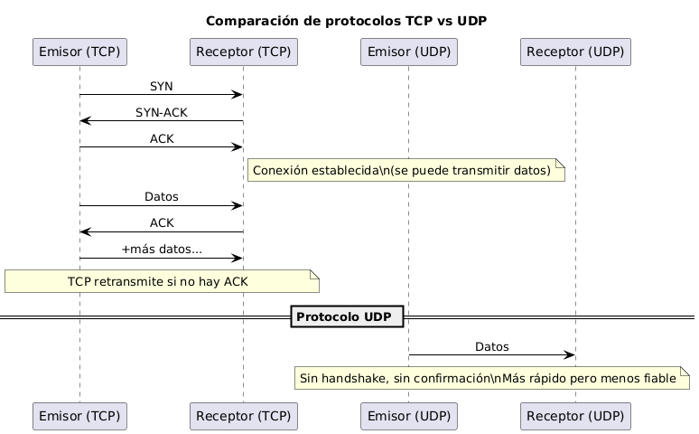
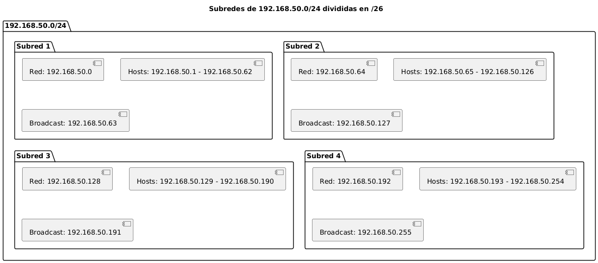
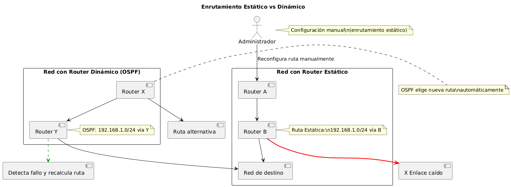
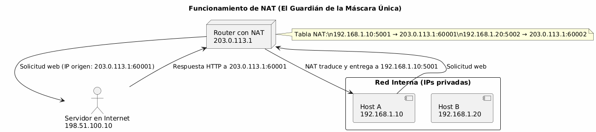
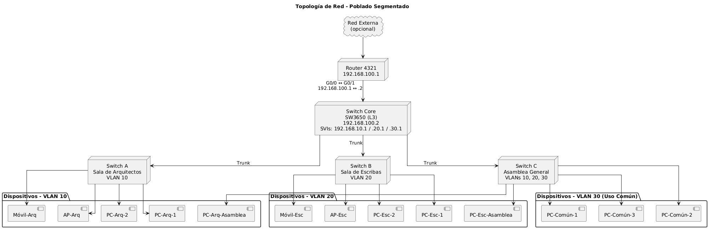
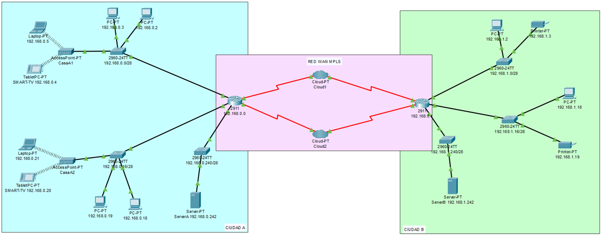
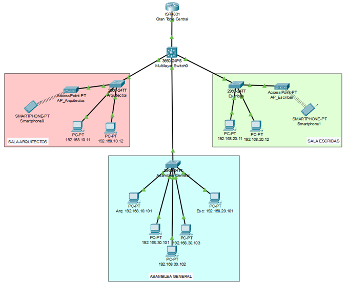
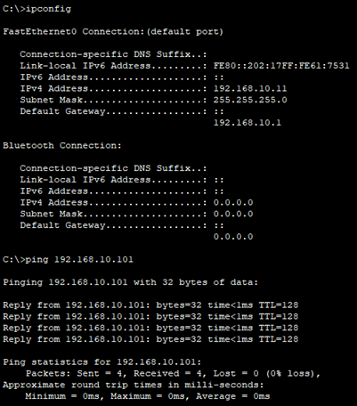
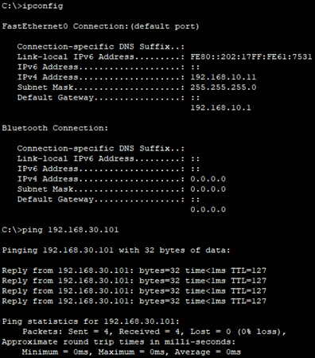

# EXAMEN PARCIAL

repositorio: https://github.com/mdedifer/Parcial_Redes  
pages: https://mdedifer.github.io/Parcial_Redes/

## Parte 1: Teoría y Conceptos

### 1. El mural de las 7 Capas

Esto es una metáfora del modelo OSI (Open Systems Interconeccion). Las "siete inscripciones" hacen referencia a las 7 capas del modelo OSI, un marco de referencia para entender cómo se comunican los dispositivos en una red.  

Cada capa transforma los datos y los entrega a la siguiente, desde la señal eléctrica (capa física) hasta la aplicación que ve el usuario (capa de aplicación).  

Las 7 capas son:  
| Capa | Nombre               | Función Principal                                              | Ejemplo                      |
|------|----------------------|----------------------------------------------------------------|------------------------------|
| 7    | Aplicación           | Interacción directa con el usuario y aplicaciones              | HTTP, FTP, SMTP              |
| 6    | Presentación         | Traducción de formatos, cifrado, compresión                    | Codificación de video, SSL   |
| 5    | Sesión               | Control del inicio, mantenimiento y finalización de sesiones   | Sesiones de login            |
| 4    | Transporte           | Entrega fiable (TCP) o rápida (UDP), control de flujo/errores  | TCP, UDP                     |
| 3    | Red                  | Encaminamiento de paquetes, direccionamiento IP                | IP, routers                  |
| 2    | Enlace de Datos      | Entrega de tramas entre nodos, detección/corrección de errores | Ethernet, dirección MAC      |
| 1    | Física               | Transmisión de bits por el medio físico                        | Cables, señales, Wi-Fi       |
  
El modelo OSI es un modelo conceptual. Es muy completo y con bien estructurado, lo que facilita el aprendizaje y la compresión de cómo funcionan las redes.  
En la práctica se utiliza mucho más el modelo TCP/IP, ya que se basa en protocolos reales usados en redes y por ello es más fácil de implementar.

### 2. Los dos pergaminos del mensajero

La metáfora de los mensajeros hace referencia a 2 protocolos de transporte reales muy utilizados en redes.  
El **mensajero confiable** hace referencia al TCP (Transmission Control Protocol), el cual es confiable y orientado a conexión.  
El **mensajero veloz** hace referencia al UDP (User Datagram Protocol), el cual es no confiable y no está orientado a conexión.  

| Característica           | TCP (Mensajero confiable)                    | UDP (Mensajero veloz)                    |
|--------------------------|----------------------------------------------|------------------------------------------|
| Conexión                 | Establece conexión antes de enviar           | No requiere conexión previa              |
| Fiabilidad               | Garantiza entrega (con ACK, retransmisiones)| No garantiza entrega                     |
| Orden                    | Mantiene el orden de los segmentos           | No asegura orden                         |
| Control de flujo         | Sí (evita saturar al receptor)              | No                                        |
| Control de errores       | Sí (checksum, ACK, retransmisiones)         | Solo detección, no corrección            |
| Velocidad                | Más lento (por el control adicional)        | Más rápido (menos sobrecarga)            |
| Uso típico               | Web, correo, archivos                        | Streaming, VoIP, juegos online           |

En resumen:  
- TCP (Mensajero confiable):
    - Garantiza que el mensaje llegue completo y en orden.
    - Es más lento por la sobrecarga de control y confirmaciones.
    - Ideal cuando no se puede perder información (email, HTTP, FTP).
- UDP (Mensajero veloz):
    - Muy rápido, ideal para tiempo real.
    - Puede perder paquetes, no reintenta.
    - Ideal cuando importa más la velocidad que la precisión (voz en tiempo real, videojuegos).  

### 3. El enigma de las subredes

La metáfora de la losa de piedra con inscripciones hace referencia al subnetting dentro de una red.  
La dirección de la red principal es 192.168.50.0 y queremos dividirla en 4 subredes de igual tamaño, una para cada "gremio".  
En esta situación, no se nos ha especificado una máscara de subred, por lo que podría tener cualquier máscara. Pese a esto, en redes IPv4 privadas suele ser siempre /24,  (máscara de subred 255.255.255.0), pudiendo albergar hasta 254 dispositivos. En el caso de tener una máscara más grande (/23 por ejemplo), la red sería más grande, por lo que la división que haríamos resultaría en 4 subredes también más grandes. Lo mismo pasaría si la máscara fuese más pequeña.  
Haremos esta suposición de ser una red/24 por convención y formato de la dirección IP.  
Para obtener 4 subredes, necesitaremos poder cambiar 2 bits posteriores, que al tener 2 valores posibles (0, 1), resultarían en 4 posibilidades más. Eso nos deja que las subredes resultantes tendrán máscara /26 (255.255.255.292). Con este tamaño de red, se disponen de 64 direcciones totales, lo cual implicaría la posibilidad de tener hasta 62 dispositivos (quitando red y broadcast).  

Las subredes generadas serán:
| Subred | IP de red         | Rango de hosts utilizables        | Dirección de broadcast |
|----------|-------------------|-----------------------------------|-------------------------|
| 1        | 192.168.50.0/26      | 192.168.50.1 – 192.168.50.62       | 192.168.50.63           |
| 2        | 192.168.50.64/26     | 192.168.50.65 – 192.168.50.126     | 192.168.50.127          |
| 3        | 192.168.50.128/26    | 192.168.50.129 – 192.168.50.190    | 192.168.50.191          |
| 4        | 192.168.50.192/26    | 192.168.50.193 – 192.168.50.254    | 192.168.50.255          |

### 4. La encrucijada de las rutas

La metáfora del tótem tallado del enunciado con flechas hace referencia a un router, que es el que encargado de redireccionar y organizar las rutas en una red.  
El tótem, dentro del router puede representar algo más específico, la tabla de enrutamiento. Todo router necesita esta tabla que indica por dónde (interfaz) debe enviarse cada paquete IP, dependiendo de su dirección de destino. 
Las flechas talladas en piedra simbolizan rutas fijas: enrutamiento estático.
Las flechas móviles que se reorientan simbolizan rutas adaptativas: enrutamiento dinámico.  
| Campo típico en la tabla         | Descripción                          |
|----------------------------------|--------------------------------------|
| Dirección de destino             | Red o subred a alcanzar              |
| Máscara de subred                | Define el tamaño del destino         |
| Puerta de enlace (gateway)       | IP del siguiente salto               |
| Interfaz de salida               | Puerto físico o lógico del router    |
| Métrica                          | Coste o preferencia de la ruta       |
| Tipo de ruta                     | Estática o dinámica                  |

**Enrutamiento estático vs enrutamiento dinámico:**  
| Característica           | Enrutamiento estático (flechas talladas) | Enrutamiento dinámico (flechas móviles) |
|--------------------------|------------------------------------------|------------------------------------------|
| Configuración            | Manual                                   | Automática con protocolos                |
| Adaptabilidad            | No se adapta a cambios en la red         | Se actualiza ante fallos o congestión    |
| Escalabilidad            | Limitada (útil en redes pequeñas)        | Alta (mejor para redes grandes)          |
| Protocolos involucrados  | Ninguno (definido por el administrador)  | RIP, OSPF, EIGRP, BGP                    |
| Mantenimiento            | Más simple pero rígido                   | Requiere más recursos, pero es flexible  |
| Ejemplo                  | Red doméstica fija                       | Red empresarial o de backbone            |

Con respecto al enrutamiento dinámico, por ser más complejo, vamos a entrar más en detalle. Las direcciones en un enrutamiento dinámico cambian mediante protocolos de enrutamiento.  
Los routers se comunican entre ellos constantemente mediante estos protocolos de enrutamiento dinámico (como pueden ser OSPF o RIP). Esto les permite:
- Detectar caídas de enlaces (por ejemplo, si se desconecta un cable o falla un router intermedio).
- Detectar cambios de topología, como la aparición de una nueva red.
- Ajustar sus rutas automáticamente, eligiendo el mejor camino disponible en ese momento.

### 5. El Guardián de la Máscara Única

La metáfora del enunciado habla sobre un guardián que cambia las máscaras de los mensajeros por la suya propia antes de que salgan al exterior, y luego les devuelve la respuesta correspondiente.  
Esto es una técnica moderna de redes: NAT (Network Address Translation) Más específicamente, el guardián hace referencia a NAT con sobrecarga (PAT, Port Address Translation).  
En la metáfora:
- Los habitantes de la ciudad = dispositivos internos (IPs privadas)
- El guardián = router con NAT
- La máscara única = IP pública
- El acto de reemplazar la máscara = el router sustituye la IP privada por su IP pública y guarda un registro de la traducción.

NAT permite que múltiples dispositivos de una red interna (con direcciones IP privadas) compartan una única dirección IP pública para comunicarse con el exterior.

En específico, NAT con sobrecarga, también llamado PAT (Port Address Translation), es una variante de NAT que permite que múltiples dispositivos compartan una sola dirección IP pública, diferenciándose por el número de puerto.

**NAT traficional vs NAT con sobrecarga (PAT):**

**Funcionamiento de NAT:**  
Cuando un equipo con IP privada (por ejemplo, 192.168.1.10) quiere acceder a internet, el router reemplaza la IP origen por su IP pública (por ejemplo, 203.0.113.1) y guarda una entrada en su tabla NAT (192.168.1.10:4321 → 203.0.113.1:60001). Cuando llega la respuesta del servidor, el router consulta la tabla y redirige el paquete al equipo interno original.  

**Beneficios del uso de NAT**
1. Ahorro de direcciones IP públicas: Muchas máquinas internas usan una sola IP pública
2. Seguridad básica: Las IPs privadas no son visibles desde el exterior, lo que dificulta el acceso directo  
Otros beneficios podrían ser: control de tráfico saliente, aislamiento de red interna... 

## Parte 2: Práctica

### P1: La ruta perdida entre 2 reinos
Para este proyecto, las interpretaciones que he hecho del enunciado han sido:
- Reconstruir la ruta perdida entre dos ciudades incomunicadas: Reestableceremos el enlace mediante una conexión WAN entre las dos redes locales, LANs (ciudades).
- Cable histórico, pese a en una primera instacia interpretar el cable histórico como un cable serial punto a punto, típico en la utilización de redes WAN en Packet Tracer, opté por utilizar gigabitEthernet, ya que es más realista y tiene mejores prestaciones (pese a ser más compleja su implementación). Finalmente tuve que cambiar esto por falta de puertos disponibles en el router principal de cada ciudad.
Además, se utilizará diseño modular para ofrecer mayor escalabilidad, en caso de querer expandir las ciudades en un futuro.

#### Modelo por capas
En este ejercicio he querido seguir un modelo de red real, separando bien cada capa de red. Tendremos:  
- **Capa 3 (Red):** Router core, cloud WAN y servidores.  
Se ocupan de la interconexión entre las redes (LAN-WAN) y del ruteo IP.
- **Capa 2 (Enlace):** Switches core, switches de casa, switches de servidores y APs. Estan en la misma capa pese a tener funciones diferentes. Los switches de casas (2960) actúan como switches de acceso que distribuyen la conexión entre los dispositivos de las casas.  
Gestionan la comunicación dentro de la red local.
- **Capa 1 (Física):** : Cables, interfaces y APs. Utilizamos en casi toda la red GigabitEthernet (incluso en la conexión a los APs), excepto en las conexiones a dispositivos finales como PCs o impresoras que utilizarán fastEthernet y los dispositivos inalámbricos que se conectarán por WiFi.
Se encargan de la transmisión eléctrica, óptica o radioeléctrica de los bits.

#### Interconexión de las ciudades
Como acabo de mencionar, se utilizará una interconexión WAN entre las dos ciudades. En específico utilizaremos WAN MPLS, ya que proporciona mayor eficiencia, control del tráfico y escalabilidad en comparación con una WAN tradicional basada únicamente en routing IP.  
Además, he implementado redundancia en este enlace WAN utilizando dos Clouds que representan enlaces MPLS alternativos. Cada router se conecta a ambas clouds para asegurar mayor robustez y disponibilidad.
En un inicio esta conexión se trató de hacer con el router IRS4321 ya que se podía añadir un módulo de fibra óptica. El problema es que solo se podía añadir un puerto, por lo que descarté esta opción para priorizar el uso de redundancia, ofreciendo mayor disponibilidad.  
Tras esta decisión, la conexión entre los routers y las clouds se pretendía realizar mediante GigabitEthernet en su totalidad. Como he mencionado antes, es más realista y ofrece mayor velocidad que el cable serial DCE/DTE.  
Tras esto, el enlace principal a la cloud iba a ser GigabitEthernet y el secundario FastEthernet, ya que en el router utilizado (el 2911, ya que descarté el 4321 por no tampoco poder tener 4 puertos ethernet, siendo imposible la redundancia) solo tiene 3 puertos GigabitEthernet y solo se pueden añadir módulos FastEthernet.  
Esto era una solución muy realista, siendo la ruta principal de MPLS la de mayor capacidad y la secundaria más lenta, al ser una conexión de respaldo.
Finalmente, no se pudo hacer ninguna de estas opciones, ya que los módulos de ethernet no permitían asignar IPs, necesario para el enlace cloud y para las subredes de cada casa. La solución utilizada en el proyecto fue utilizar cables seriales para la conexión WAN, lo cual es muy común en escenarios de simulación en Packet Tracer. A pesar de esto, seguí manteniendo un enlace principal y otro secundario, asignando prioridad 10 a este último.
En resumen, aunque la fibra y ethernet ofreceríab mayor ancho de banda, he priorizado la alta disponibilidad y robustez de la redundancia. 

#### Ciudades

Las 2 ciudades tienen una estructura similar a excepción de las casas. Cuentan con:  
- Router core (ISR4321): Interconecta las diferentes redes, tanto subredes locales (casas) como hacia el exterior a través de la red WAN MPLS.
- Switch de servidor (2960): Su función es conectar físicamente los servidores a la red local, aislando el servidor del resto de la red, ofreciendo más seguridad.
- Servidor: aunque en este caso lo hemos dejado como servidor genérico, podría ofrecer servicios de red a los dispositivos de su ciudad como web, archivos, impresión o DNS.
- Switches de casa (2960): Repartirán el tráfico dentro de cada casa.

#### Casas ciudad A

Utilizando distribución modular, las casas de la ciudad A (2 casas) serán iguales, facilitando una posible expansión futura.  
Las casas contarán con:
- Switch 2960: distribuirá el tráfico a la casa y gestionará una subred propia.
- 2 PCs que se conectaran por cable FastEthernet.
- AccessPoint (genérico de Cisco): que ofrecerá conexión inalámbrica.
- Laptop genérico
- TabletPC (que usaremos simulando que fuese una smartTV)

#### Casas ciudad B

Siguiendo con la distribución modular, las casas de la ciudad B (3 casas) estarán formadas por:
- Switch 2960: distribuirá el tráfico a la casa y gestionará una subred propia.
- 1 PC conectado por cable FastEthernet.
- 1 impresora, conectada también por cable FastEthernet.

#### Enrutamiento

Cada ciudad va a contar con una red principal, las cuales estarán interconectadas por la conexión WAN MPLS.  
Dentro de cada una de estas redes, cada casa tendrá una subred propia /28, que permite tener 14 direcciones IP utilizables (16 IPs en total).  

**Plan de direccionamiento completo:**    
CIUDAD A - Subred principal: 192.168.0.0/24:  
- Casa A1: 192.168.0.0/28 ; Gateway: 192.168.0.1:
    - PC1: 192.168.0.2
    - PC2: 192.168.0.3
    - AP: SSID: CasaA1
    - Tablet (SmartTV): 192.168.0.4
    - Laptop: 192.168.0.5
- Casa A2: 192.168.0.16/28 ; Gateway 192.168.0.17
    - PC1: 192.168.0.18
    - PC2: 192.168.0.19
    - AP: SSID: CasaA2
    - Tablet (SmartTV): 192.168.0.20
    - Laptop: 192.168.0.21
- Servidor: 192.168.0.240/28 ; Gateway 192.168.0.241
    - Servidor: 192.268.0.242

CIUDAD B - Subred principal: 192.168.1.0/24: 
- Casa B1: 192.168.1.0/28 ; Gateway: 192.168.1.1:
    - PC: 192.168.1.2
    - Impresora: 192.168.1.3
- Casa B2: 192.168.1.16/28 ; Gateway: 192.168.1.17:
    - PC: 192.168.1.18
    - Impresora: 192.168.1.19
- Casa A1: 192.168.1.32/28 ; Gateway: 192.168.1.33:
    - PC: 192.168.1.34
    - Impresora: 192.168.1.35
- Servidor: 192.168.1.240/28 ; Gateway 192.168.1.241:
    - Servidor: 192.268.1.242

ENLACES WAN:
- WAN Primario (Cloud 1): 10.0.0.0/30 ; IP Ciudad A: 10.0.0.1 ; IP Ciudad B: 10.0.0.2
- WAN Secundario (Cloud 2): 10.0.0.4/30 ; IP Ciudad A: 10.0.0.5 ; IP Ciudad B: 10.0.0.6
- Cloud 1 - Cloud 2: 10.0.0.8/30; IP Ciudad A: 10.0.0.9 ; IP Ciudad B: 10.0.0.10  

#### Imágenes del proyecto:

Diagrama estructura proyecto:
  

Captura Cisco:  
  

### P2: La ciudad de las redes aisladas

#### Introducción

Para este ejercicio, vamos a plantear la gran metrópolis central. Esta antigua ciudad quedó en ruinas y en los pocos edificios que no estaban derruidos vamos a construir una red para simular cómo habría trabajado antigua civilización si hubiesen tenido la tecnología que tenemos hoy en día.  

#### Estructura general del poblado

El proyecto estará compuesto por:
- 1 gran torre central que estará formada por 2 elementos principales de la red
    - Router de la metrópolis
    - Switch core (capa 3) que hará enrutamiento, actuando como router (capa 3)
- 1 sala de Arquitectos: contendrá solamente la red exclusiva del gremio de arquitectos (VLAN 10)
- 1 sala de Escribas: contendrá solamente la red exclusiva del gremio de escribas (VLAN 20)
- 1 asamblea general: Espacio compartido donde conviven miembros de todos los gremios.(VLANs 10, 20 y 30)

#### Infraestructura de Red

En este ejercicio también he seguido el modelo de capas OSI, teniendo capa de acceso, de distribución y de red.  
Además, sigo utilizando modularidad, haciendo que las salas funcionen como bloques lógicos. Esto ofrece una gran escalabilidad, pudiendo añadir más switches o VLANs fácilmente.  

La red está compuesta por:
- Router 4321 (capa 3)
- Switch core (capa 3), Cisco Catalyst 3650: encargado del Inter-VLAN routing y punto central de toda la red.
- Switches de acceso (capa 2), Cisco 2960: reparten tráfico en cada una de las salas, conectando los dispositivos a las redes correctas.

Tanto la sala de arquitectos como la de escribas tendrá dispositivos únicamente con acceso para los propios de sus gremios:
- 2 PC
- 1 AP
- 1 smartphone  
Por otro lado, la asamblea general tendrá:
- 1 PC de arquitectos (VLAN 10), para que el secretario arquitecto tome sus propias actas de las sesiones.
- 1 PC de escribas (VLAN 20), para que el secretario escriba pueda hacer lo mismo.
- 3 PC de uso común (VLAN 30), al que podrá acceder cualquier persona.

Cada una de las salas tendrá un switch de acceso (capa 2) que manejará el tráfico de esta.

#### Segmentación lógica - VLANs y subredes

Habrá 3 VLANs como hemos comentado antes:
- VLAN 10 - Subred de Arquitectos. IP: 192.168.10.0/24
- VLAN 20 - Subred de Escribas. IP: 192.168.20.0/24
- VLAN 30 - Subred del pueblo. IP: 192.168.30.0/24

Cada VLAN está asociada a una SVI en el switch core, que actúa como default gateway para los dispositivos de esa red.  
Gracias a esta segmentación VLAN, la red global ofrece más seguridad, impidiendo tráfico innecesario entre grupos.

#### Enrutamiento

Redes:
- Sala de arquitectos: IP subred asociada (VLAN 10): 192.168.10.0/24, gateway: 192.168.10.1
- Sala de Escribas: IP subred asociada (VLAN 20): 192.168.20.0/24, gateway: 192.168.20.1
- Asamblea General: IP subredes asociadas: 192.168.10.0/24 (VLAN 10), 192.168.20.0/24 (VLAN 20), 192.168.30.0/24 (VLAN 30) gateway: 192.168.10.1 (para esta última VLAN)

IPs dispositivos:
- Los dispositivos de la sala de Arquitectos y de Escribas comenzarán por la IP 192.168.10.11 y 192.168.20.11 respectivamente.
- Los dispositivos de la Asamblea General empezarán por el .101 de cada subred (VLAN). Quedaría así:
    - PC arquitectos: IP 192.168.10.101
    - PC escribas: IP 192.168.20.101
    - PCs resto: IP 192.168.30.101 , .102 y .103
- Los dispotivos inalámbricos en un principio iban a utilizar DHCP en vez de utilizar una IP estática, permitiendo mayor flexibilidad y escalabilidad. Esto en Cisco Packet Tracer tiene bastantes limitaciones incluso habiendo un servidor DHCP bien configurado, ya que los smartphones pueden no obtener IP o no aplicarla. Es por eso que finalmente opto por asignar IPs estáticas.

##### Imágenes del proyecto.
Estructura del proyecto:  
  

Captura de Cisco Packet Tracer:  

Ping desde un PC de la sala de arquitectos hacia el PC de arquitectos de la asamblea General (INTRALAN):  
  

Ping desde un PC de la sala de arquitectos hacia un PC general de la asamblea General (INTERLAN):  
  

